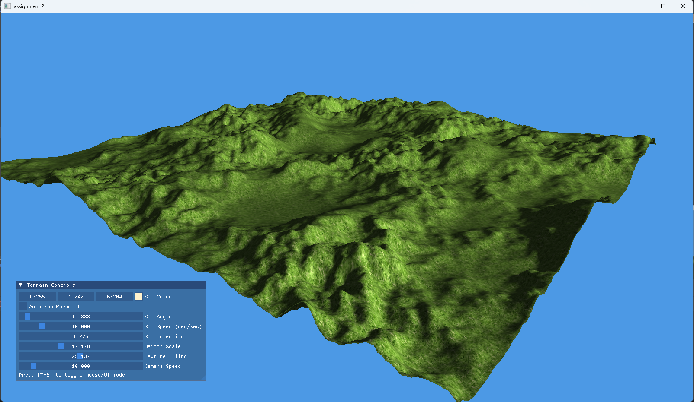

# Assignment 2 – 3D Terrain with Lighting and ImGui Controls

A 3D terrain generated from a heightmap and textured with grass.  
Lighting and height scale can be adjusted in real-time via ImGui panel.

### 🎮 Controls
| Key | Action |
|-----|--------|
| WASD | Move camera |
| Mouse | Look around |
| ESC | Exit |
| ImGui Panel | Adjust Light, Height scale |

### 🖼️ Preview

### 🎥 Video Demo
[▶ Watch 20-sec demo](https://youtu.be/civv6KfAhSQ)

### 🧰 Tools
- C++20 with OpenGL 4.6
- GLFW, GLAD, GLM, ImGui
- Custom `Shader`, `Texture`, `Camera`, `Terrain` classes
- Assets from `~/assets`

### 📜 Credits
- `grass.jpg` texture: [Source](https://www.freepik.com/free-vector/grass-shape-background-design_893901.htm#fromView=keyword&page=1&position=5&uuid=242cc78f-5c82-4e55-afbe-5cad624d83f4&query=Grass+texture)
- `heightmap.png` generated/credited to [Source](https://en.wikipedia.org/wiki/File:Heightmap.png)