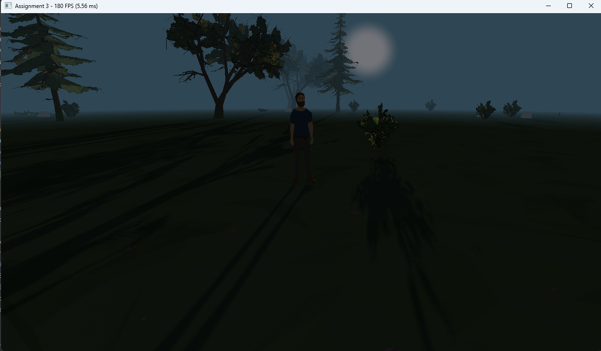

# Assignment 3 — 3D Game: Model Loading, Camera, and Collision

## Project Overview

This project is a simple 3D survival-style game developed for the “3D Game Development using C/C++ and OpenGL” course.
The goal is to demonstrate real-time rendering, camera control, model loading, and basic collision detection between player and the world.

The player can control a character moving around a small 3D environment with trees, rocks, and other decorative objects.
A third-person camera smoothly follows the player, and basic collisions prevent walking through solid objects.
The game is built on top of a reusable framework shared across previous assignments (Shader, Model, Texture, Renderer, etc.).
---
## Features
### Rendering and Graphics
- **Model loading with Assimp**
<br>Loads external .fbx models and textures for player, items, and environment (trees, rocks, etc.).

- **Textured 3D environment**
<br>The world is procedurally populated with models using a custom WorldSpawner system.

- **Directional lighting and shadows**
<br>Implements a real-time shadow map (depth-based) with PCF soft shadows.

- **Dynamic day–night cycle**
<br>The sunlight direction, color, and sky color change gradually over time.

- **Fog and atmospheric effects**
<br>Adds exponential fog to visually blend distant objects and hide world boundaries.

- **Render layers system**
<br>Organizes drawing order for Ground, Opaque, AlphaCutout (e.g., trees/leaves), and Transparent objects.

### Player and Camera
- **Player model control**
<br>The player character can move around using WASD keys.
<br>The movement direction aligns with the camera facing.
- **Third-person follow camera**
<br>The camera smoothly follows the player with adjustable pitch, yaw, distance, and height.
- **Animation support**
<br>animation blending using Animator and Animation classes (idle, walk, run).

### Gameplay Mechanics
- **Collision detection**
    - Player–Scene collisions prevent walking through static objects such as trees and rocks.
    - Player–Item collisions allow picking up collectible items (e.g., apples, bottles).
- **Item spawning**
<br>`ItemSpawner` randomly places items across the terrain for the player to collect.
- **Environment generation**
<br>`WorldSpawner` creates a randomized terrain decoration using trees, rocks, and grass models.

### Performance and Optimization
- **Distance culling** — skips drawing distant objects beyond visibility range.
- **Adaptive shadow map** — reduces shadow resolution dynamically if frame time increases.
- **FPS display** — shows frame rate and frame time on-screen and in window title.
---
## Control
| Key            | Action                      |
|----------------|-----------------------------|
| W / A / S / D  | Move player                 |
| Mouse movement | Rotate camera around player |
| E              | Pick up nearby item         |
| ESC            | Exit the game               | 
---
## Implementation Details
- **Language:** C++20
- **Graphics API:** OpenGL 4.6 Core
- **Build System:** CMake
- **Libraries:**
  - [GLFW](https://www.glfw.org/) — window and input handling
  - [GLAD](https://glad.dav1d.de/) — OpenGL function loader
  - [GLM](https://github.com/g-truc/glm) — math and transformation library
  - [Assimp](https://github.com/assimp/assimp) — model and material loading
  - [stb](https://github.com/nothings/stb) — texture loading
- **Folder Structure:**
```
a3/
├── assets/
│   ├── objects/         # models (.fbx)
│   ├── textures/        # textures (grass, leaves, etc.)
├── shaders/
│   ├── model.vert
│   ├── model.frag
│   ├── depth.vert
│   ├── depth.frag
│   ├── sun.vert
│   └── sun.frag
├── src/
│   ├── entity/
│   │   ├── player.*
│   │   ├── object.*
│   │   ├── ground_plane.*
│   ├── systems/
│   │   ├── world_spawner.*
│   │   ├── item_spawner.*
│   │   ├── item_database.*
│   │   └── inventory.*
│   ├── follow_camera.*
│   ├── game.*
│   └── main.cpp
├── CMakeLists.txt
└── README.md
```
---
## Credits
### Assets
- [Just Survive](https://initial-project.itch.io/survivalpack)
### Rigging and Animation
- [Mixamo](https://www.mixamo.com/)
---
## Media
### Preview


### Video Demo
[▶ demo](./https://youtu.be/GHLUFsbHFzs)